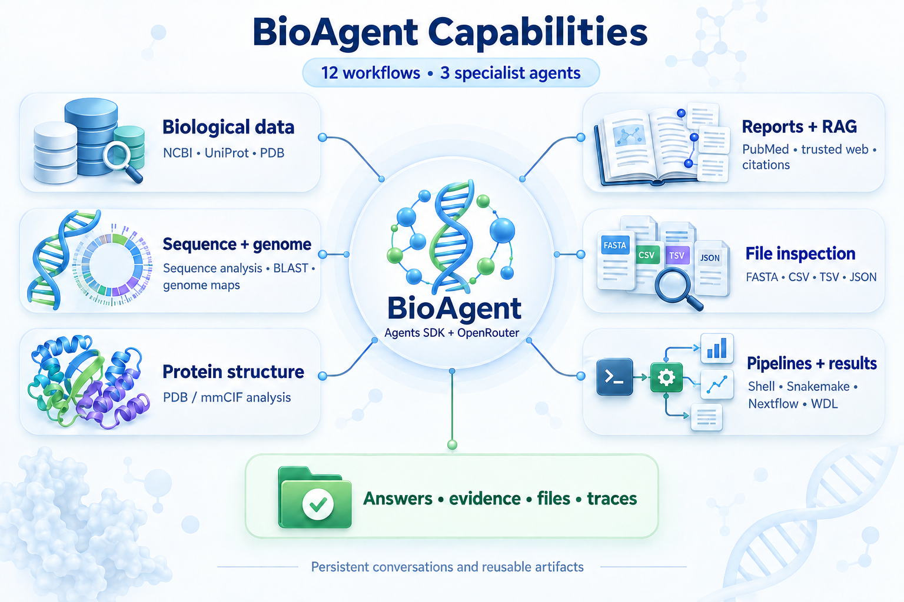
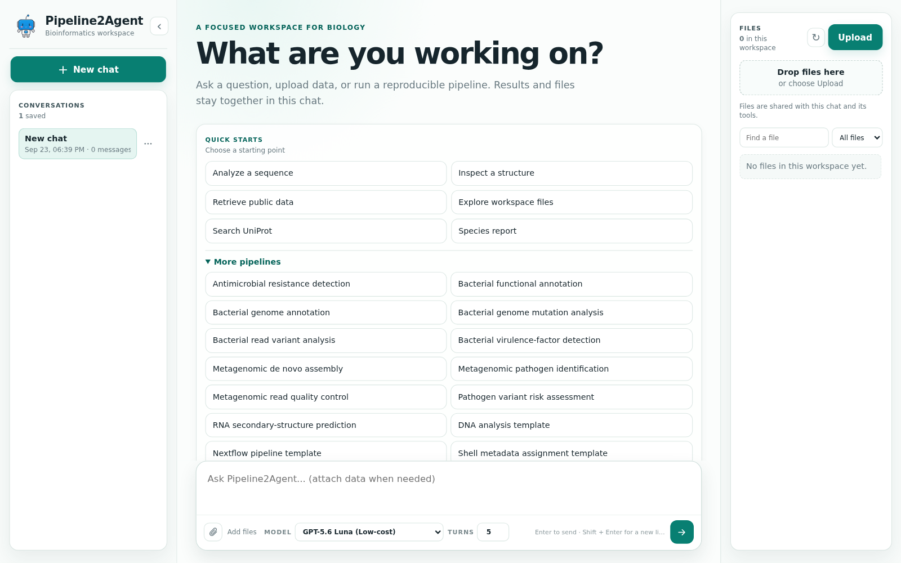

# BioAgent

BioAgent is a bioinformatics agent for biological question answering, public
database retrieval, sequence and structure analysis, evidence-backed reporting,
file inspection, and pipeline execution. It exposes deterministic biological operations as typed Agents SDK function tools behind a chat-style web UI, CLI, API, and Python interface.

## What BioAgent Does



BioAgent can:

- answer biology questions and explain biological concepts;
- retrieve records from NCBI, PubMed, UniProt, InterPro, KEGG, QuickGO, PDB,
  and AlphaFold DB;
- analyze nucleotide sequences, genome maps, and protein structures;
- inspect FASTA, CSV, TSV, JSON, Markdown, and text files;
- create species reports with sources, citations, and generated files;
- run Shell, Snakemake, Nextflow, and WDL pipelines; and
- retain uploads and generated files within a chat session.


## Quick Start


### 1. Get The Project

```bash
git clone https://github.com/ai2lifescience/BioAgent.git
cd BioAgent
```


### 2. Create An Environment

```bash
conda create -n openaisdk python=3.11 -y
conda activate openaisdk
python -m pip install --upgrade pip
python -m pip install -r requirements.txt
```


### 3. Configure A Model

The harness uses OpenRouter through the OpenAI Python client. Set an API key before running the agent or model-backed reports:

On Linux Bash:

```bash
export OPENROUTER_API_KEY="your-openrouter-api-key"
export CROMWELL_URL=http://192.168.164.39:39000
```

Replace the placeholder with your real key. The variable is available to
BioAgent commands started from the current terminal session.

Every natural-language request is handled by the Agents SDK; deterministic functions run after the agent selects their registered tools. Offline smoke tests use a scripted model and do not need an API key.

### 4. Start The Web UI

```bash
conda activate openaisdk
python -B -m interfaces.web --host 127.0.0.1 --port 8000
```

Open [http://127.0.0.1:8000](http://127.0.0.1:8000) in a browser. Stop the
server with `Ctrl+C`.

If OpenRouter needs a SOCKS proxy, set it in the same terminal before starting
the server:

```bash
export BIOAGENT_PROXY=socks5h://127.0.0.1:10801
```

`ALL_PROXY` is not required when `BIOAGENT_PROXY` is set. See the
[web usage guide](docs/web_usage.md#start-for-local-network-access) for the
complete launch command and direct-connection option.



### 5. Use BioAgent

Select a model, enter a request in the message box, and send it. Example
requests:

```text
What is GC content?
```

```text
Analyze PhiX174 segment sequence GAGTTTTATCGCTTCCATGACGCAGAAGTTAACACTTTCGGATATTTCTGATGAGTCGAAAAATTATCTT
```

```text
Search UniProt for BRCA1 human
```

```text
Download PDB structure 1A3N as cif
```

```text
Run pipeline with pipeline_name: generic_snakemake
```

```text
Run pipeline with pipeline_name: generic_nextflow
```

```text
Run pipeline with pipeline_name: generic_bio
```

```text
Run pipeline with pipeline_name: bacterial_annotation genome: "path/to/contigs.fasta" genus Escherichia species coli strain "K-12" cpus 4
```

```text
annotate_bacterial_genome genome: "path/to/contigs.fasta" annotator bakta bakta_db_path: "/opt/bakta-db/db" translation_table 11 gram - cpus 8
```

```text
Predict RNA secondary structure rna: "path/to/sequences.fasta" temperature_c 37
```

```text
Search InterPro domains for P0A7V8
```

```text
Find QuickGO annotations for UniProtKB:P0A7V8 taxid 562
```

```text
Get KEGG query: eco:b0002
```

```text
Download AlphaFold structure for P0A7V8 as cif
```

Use the Uploads panel for local input files. BioAgent stores uploads and outputs
under the active session so later requests in the same chat can reuse them.

To allow access from another computer on a trusted local network, run:

```bash
python -B -m interfaces.web --host 0.0.0.0 --port 8000
```

Then open `http://<SERVER_LAN_IP>:8000` from the other computer.

## Architecture

BioAgent is implemented as a single OpenAI Agents SDK harness. The SDK owns the
agent loop, function-tool dispatch, guardrails, sessions, and tracing. The tools
call deterministic biological libraries and registered external APIs.

```text
User / App
  -> Agent + Runner (OpenAI Agents SDK)
     -> OpenAI Python client -> OpenRouter
     -> BioAgent function tools
        -> databases, sequence/structure tools, files, RAG, pipelines
     -> SDK sessions (SQLite)
     -> SDK guardrails, tracing, and per-session Unix-local sandbox
  -> structured answer, evidence, status, and workspace files
```

The public entry point is `harness.run_bioagent`. Each run returns the answer,
SDK session ID, tool evidence, run status, trace events, and workspace file
paths. Uploads and generated files remain in per-session sandboxes.

OpenRouter model IDs are configured in `models/config.py` and are sent directly
through the OpenAI client.

## Other Interfaces


### CLI

```bash
python -m interfaces.cli "Search UniProt for BRCA1 human"
```


### HTTP API

With the web server running:

```bash
curl -X POST http://127.0.0.1:8000/run \
  -H 'Content-Type: application/json' \
  -d '{"request": "What is GC content?"}'
```


### Python

```python
from interfaces.notebook import run_bioagent

result = run_bioagent("Analyze PhiX174")
print(result["answer"])
```


## Pipeline Notes

- Shell pipelines use the local shell environment.
- Snakemake pipelines require the `snakemake` package included in
`requirements.txt`.
- Nextflow pipelines require a local `nextflow` executable, Java 17 or newer,
  and a POSIX shell. On Windows, run BioAgent and Nextflow inside WSL.
- WDL pipelines use `miniwdl` and require a working Docker daemon plus access to
the task container images.
- Pipeline inputs should be supplied explicitly through the request or uploaded
through the web UI.
- The bacterial annotation pipeline supports Prokka or Bakta; Bakta also
  requires a compatible database. See
  [its environment guide](pipelines/bacterial_annotation/README.md).
- The RNA secondary-structure pipeline requires ViennaRNA `RNAfold`. See
  [its environment guide](pipelines/rna_secondary_structure/README.md).


## Documentation

- [System architecture](docs/architecture.md)
- [Web UI usage and examples](docs/web_usage.md)
- [CLI usage and examples](docs/cli_usage.md)
- [Team development workflow](docs/dev_workflow.md)
- [Planned improvements](docs/todo.md)
