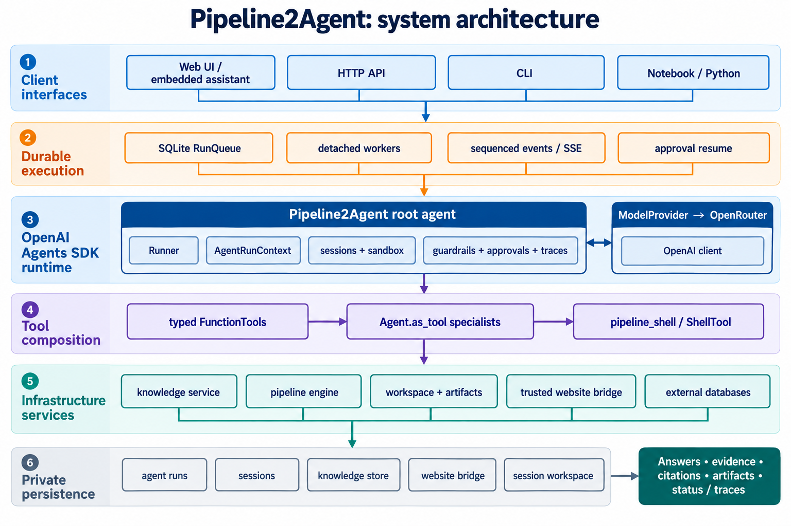

# BioAgent architecture

BioAgent uses one OpenAI Agents SDK runtime. The SDK owns model turns, tool
calling, sessions, guardrails, and tracing. BioAgent supplies typed biological
function tools and deterministic implementations for scientific operations.



## Runtime flow

```text
Web / CLI / API / notebook
        |
        v
harness.run_bioagent()
        |
        v
Agents SDK Agent + Runner
        |                    \
        |                     SDK tracing and lifecycle hooks
        |                     per-session Unix-local sandbox
        v
OpenAI Chat Completions client -> OpenRouter
        |
        v
Typed BioAgent function tools
        |
        +-- biological databases and literature
        +-- sequence, BLAST, genome, and structure analysis
        +-- file inspection and report writing
        +-- RAG and OpenRouter embeddings
        +-- approved pipeline execution and result collection
        |
        v
SDK guardrails -> structured result -> user interface
```

There is no second router, planner, model loop, or custom agent-facing tool
system. SDK-native `Agent.as_tool()` specialists are the only delegated agent
surface.
Each function tool owns its workflow and deterministic implementation under
`tools/function_tools/<tool_name>/`, so database retrieval, file access,
sequence calculations, and pipeline execution remain reproducible and easy to
trace from the model-facing tool.

## Components

### Agents SDK harness

- `harness/agent.py` defines the single `BioAgent` and its instructions.
- `harness/runtime.py` creates the `Runner`, supplies run context, and returns
  the application result.
- `tools/function_tools/` contains the public biological `FunctionTool`
  definitions and `tools/agent_tools/` contains the `Agent.as_tool()`
  specialists.
- `tools/registry.py` assembles function, agent, hosted, and runtime tools for
  the root Agent.
- `harness/guardrails.py` contains input safety and output evidence checks.
- `harness/sandbox.py` configures the SDK Unix-local sandbox around the
  per-session workspace. The SDK supplies filesystem capabilities; the
  approval-controlled pipeline FunctionTool remains the command-execution
  boundary.
- `harness/tracing.py` consumes SDK lifecycle hooks and spans locally without
  sending traces to OpenAI. The hooks provide UI progress; the SDK remains the
  source of trace/span creation.
- `harness/sessions.py` stores application metadata; conversation history is
  stored by the SDK `SQLiteSession`.

### OpenRouter client

`models/openrouter_client.py` is the only provider client. It constructs the
OpenAI `OpenAI` and `AsyncOpenAI` clients with:

- `OPENROUTER_API_KEY` for authentication;
- `OPENROUTER_API_BASE`, defaulting to `https://openrouter.ai/api/v1`;
- optional `HTTP-Referer` and `X-OpenRouter-Title` headers;
- HTTPX2 clients with explicit proxy selection from `BIOAGENT_PROXY`, falling
  back to `ALL_PROXY`/`all_proxy`.

SDK model runs and embeddings use this OpenRouter transport. LiteLLM is not part
of the project dependencies.

### Tool categories

The SDK tool surface is organized by execution semantics:

- `tools/function_tools/` — local Python `FunctionTool` wrappers for biological
  workflows. This is BioAgent's primary category.
- `tools/agent_tools/` — focused agents exposed through `Agent.as_tool()`.
- `tools/hosted_tools/` — extension point for tools executed by OpenAI-hosted
  infrastructure. It is empty until the configured model/runtime supports one.
- `tools/runtime_tools/` — the SDK local `pipeline_shell` tool and its
  allowlisted command protocol. It runs all declared pipeline engines locally.
- `tools/runtime_tools/pipeline_runtime/` — declarative pipeline planning, durable jobs,
  bounded waiting, cancellation, and result collection behind `pipeline_shell`.
- `tools/common/` — shared context, result envelopes, evidence and artifact
  classification, guardrails, and bounded HTTP transport; these are
  implementation helpers, not model-facing tools.

`harness/agent.py` calls `tools.registry.build_all_tools(model)` so the root
agent receives one SDK tool list assembled from these categories.

Import tools and helpers directly from their category packages:

```python
from tools.function_tools.file_inspection import file_inspection
from tools.agent_tools.specialists import build_specialist_tools
from tools.common.results import ToolResult
```

Function-tool packages use a consistent layout:

```text
tools/function_tools/<tool_name>/
├── __init__.py       # public SDK FunctionTool
├── workflow.py       # run-context and result presentation
├── analysis.py        # deterministic domain implementation
├── adapters/         # optional external database clients
└── engine/           # internal execution backends used by pipeline_shell
```

Small tools keep one descriptive implementation module, such as `analysis.py`,
`inspection.py`, or `diagnostics.py`, and `workflow.py` only when they need
run context or result presentation. A
package should add a subpackage only for a real subsystem, such as NCBI
Entrez, species-report literature/web/RAG collection, or pipeline engines.
Shared context, result envelopes, guardrails, and HTTP transport belong under
`tools/common/`. Cross-tool imports are limited to explicit reusable domain
adapters, such as structure download code reused when a PDB ID must be
analyzed; public FunctionTool wrappers are never imported as implementation
dependencies.

### Function tools and workflows

Every agent-facing workflow in `tools/function_tools/` is an OpenAI Agents SDK
`FunctionTool`. The SDK `@function_tool` decorator owns its name, description,
argument schema, validation, invocation, and failure handling. The same
function-tool package contains the workflow and its deterministic adapters,
clients, and domain code. These implementations do not create another agent
loop or require a second tool registry.

### Tool routing contract

The root agent does not use a separate keyword router. When a request arrives,
the Agents SDK presents the model with the registered tool names, descriptions,
and JSON schemas. The model selects the tool whose documented purpose best
matches the user's intent and emits arguments that conform to that schema. The
SDK validates those arguments, invokes the Python function, and gives the
result back to the model for the final response.

Routing-critical information belongs in five places:

1. **Function names** — name one clear operation.
2. **Function docstrings** — explain what the tool does, when to use it, and
   when another tool is more appropriate.
3. **Parameter descriptions** — explain ambiguous inputs and side effects.
4. **Type constraints** — use annotations, `Literal`, and `pydantic.Field` to
   constrain the arguments the model can generate.
5. **Agent instructions** — define cross-tool policy, safety rules, and how
   the agent should use the available tools.

The SDK derives the tool schema from these definitions, validates the model's
arguments, invokes the Python function, and returns its result to the model.
Each tool should remain bounded, expose side effects and approval requirements,
and return the common `status`/`data`/`files`/`evidence`/`error` envelope.

Runtime tools such as `ShellTool`, `ApplyPatchTool`, and `ComputerTool` are
execution primitives, not replacements for domain workflows. A generic shell
route would bypass pipeline manifests, workspace path checks, job recovery, and
output collection. Keep those primitives separate from the model-facing
pipeline tools unless a narrowly scoped diagnostic or editing agent needs one.

For example, a request to search AlphaFold should select `database_lookup` with
`database="alphafold"`, while a request for sequence similarity should select
`blast_search`. This is model-based semantic routing, so overlapping tool
descriptions make selection less reliable; deterministic routing should be
implemented in code when a workflow requires predictable dispatch.

The primary intent boundaries are:

| User intent | Direct route |
| --- | --- |
| Raw nucleotide or protein records | `ncbi_retrieval` |
| Cited organism research or Markdown report | `species_report` |
| Database annotations or metadata | `database_lookup` |
| Download an RCSB PDB file | `pdb_download` |
| Analyze a structure | `protein_structure_analysis` |
| Sequence metrics or ORFs | `sequence_analysis` |
| File metadata or previews | `file_inspection` |
| Sequence similarity | `blast_search` |
| Genome feature image | `genome_map` |
| Execute or monitor a pipeline | `pipeline_shell` (`bioagent-pipeline` protocol) |
| Review completed pipeline outputs | `pipeline_shell results --job-id ID` |

Use a specialist only when the request combines multiple routes in one domain;
use the direct route for a single operation.

The long-running pipeline migration is described in
[`docs/pipeline_migration.md`](pipeline_migration.md). It preserves the
deterministic engine implementations while moving process lifetime and recovery
to a durable job boundary.

The files under `skills/*/SKILL.md` document workflows for developers, but are
not loaded automatically by the runtime and do not route requests. Routing
information that the model must see belongs in the FunctionTool name,
docstring, schema descriptions, or agent instructions.

### Specialist agents

`tools/agent_tools/specialists.py` defines focused agents for sequence, retrieval, and
pipeline domains. Each specialist owns a smaller set of FunctionTools and is
exposed to the root agent with `Agent.as_tool()`. This is useful when a domain
requires several related tools and its own instructions; the root agent keeps
control of the user-facing answer.

The root agent exposes both `FUNCTION_TOOLS` and these specialist tools, so some
requests have direct and delegated routes. If routing becomes ambiguous as the
tool catalog grows, choose one boundary per domain: expose the underlying tools
directly, or expose them only through their specialist.

The workflow wrapper keeps the common envelope at the SDK boundary while
preserving raw action results inside `BioRunContext` for evidence collection
and workspace file discovery.

The SDK run context carries:

- the session identifier;
- run and workspace directories;
- user context and workspace file references;
- model key;
- progress callback;
- per-run workflow results.

The same function-tool package contains each workflow and its deterministic
adapters, clients, and domain code. These implementations do not create
another agent loop or require a second tool registry. The direct public
FunctionTools are listed by
`tools.function_tools.FUNCTION_TOOLS`;
the complete root surface is assembled by `tools.registry.build_all_tools`.

### Sessions and workspace files

`SQLiteSession` persists user and assistant messages in
`runtime/agent_sessions.sqlite3` (configurable with `BIOAGENT_SESSION_DB`).
Application metadata is persisted in `runtime/session_metadata`.

The SDK session is the single source of truth for conversation history. The
browser stores only the active session identifier in `localStorage`; it does
not cache messages or maintain a second conversation database. `GET
/sessions/<session-id>/messages` reads displayable user and assistant items
from `SQLiteSession`, while `Runner.run(..., session=sdk_session)` continues
to append new items. Application metadata remains separate because titles,
locks, resumable approval snapshots, and workspace lifecycle are application
concerns rather than conversation history.

The history endpoint returns conversation text and current approval controls.
Per-run evidence and diagnostic cards remain in memory while the page is open;
workspace files remain available after reload through the sandbox listing.

The SDK Unix-local sandbox uses the session directory as its workspace. This
keeps host-side FunctionTools and SDK filesystem capabilities pointed at the
same files:

```text
runtime/sessions/<session-id>/
├── uploads/
├── outputs/
└── runs/
```

The sandbox is the file owner. The API exposes workspace-relative file paths;
there is no artifact registry or generated artifact ID. The local Unix backend
shares the host OS, so it is a development workspace rather than a strong
security boundary. Use a container-backed SDK sandbox when process isolation is
needed.

Run-specific temporary files use the same workspace:

```text
runtime/sessions/<session-id>/uploads/
runtime/sessions/<session-id>/outputs/<generated files>
runtime/sessions/<session-id>/runs/<run-id>/
```

The result contains references to files instead of copying large contents into
conversation history. The web interface can download any regular workspace
file; the structure viewer is an optional format-specific presentation.

### Guardrails and run status

The input guardrail blocks requests asking for actionable harmful biological
procedures. Tool guardrails validate each FunctionTool envelope, and the output
guardrail checks the final answer. The API returns the run `status` directly
(`ok`, `pending_approval`, `blocked`, or `error`).

Evidence collection lives in `tools/common/evidence.py` beside tool result
semantics. The harness calls it after a run so the UI can receive citations,
record IDs, URLs, and workspace file paths without making tools import the harness.

High-risk pipeline behavior should remain explicit in tool input and output.
Pipeline execution pauses with an SDK `RunState` interruption and returns an
approval identifier. Call `interfaces.api.handle_approval` (or POST `/approve`)
to approve or reject it; approval resumes the saved state without replaying the
original model request.

### Tracing

The SDK creates traces and spans for agent, model, tool, handoff, and guardrail
operations. `LocalTraceProcessor` records redacted lifecycle metadata for the
current run. `BioAgentHooks` sends progress messages to CLI and streaming HTTP
callers. External trace export is disabled by default because OpenRouter is the
model endpoint and does not provide the OpenAI trace destination.

## Interfaces

All interfaces call the same runtime:

```python
from harness import run_bioagent

result = run_bioagent("Analyze this FASTA sequence", session_id="chat-1")
print(result["answer"])
```

The synchronous wrapper is used by CLI, HTTP, and ordinary Python callers. Use
`async_run_bioagent` in an application that already owns an asyncio event loop.

The web workspace is a thin adapter over the SDK sandbox session. It exposes
one session-scoped workspace resource for listing, upload, read/download, and
delete operations; it does not create a second file registry or agent runtime.

The HTTP contract is deliberately path-based and workspace-root-relative:

| Request | Purpose |
| --- | --- |
| `GET /workspace?session_id=...` | List every regular file in the session workspace. |
| `POST /workspace/files` | Upload multipart files into `uploads/`. |
| `GET /workspace/file?session_id=...&path=...` | Read or download one workspace file. |
| `DELETE /workspace/files/<path>?session_id=...` | Delete one workspace file. |

Session history uses the SDK session contract:

| Request | Purpose |
| --- | --- |
| `GET /sessions` | List application session metadata and message counts. |
| `GET /sessions/<session-id>/messages` | Read conversation messages from the SDK `SQLiteSession`. |

The browser receives file metadata from the sandbox listing and uses the
workspace-relative path for later operations. There are no upload-only APIs,
generated file IDs, or host-path reads in the web contract.

## Configuration

Create the environment and install the complete runtime:

```bash
conda activate openaisdk
python -m pip install -r requirements.txt
python -m pip check
```

Set the provider key before a live run:

```bash
export OPENROUTER_API_KEY="..."
```

For OpenRouter traffic, set `BIOAGENT_PROXY` in the terminal before starting
the server:

```bash
conda activate openaisdk
export BIOAGENT_PROXY=socks5h://127.0.0.1:10801
python -B -m interfaces.web --host 0.0.0.0 --port 8000
```

`BIOAGENT_PROXY` takes priority over `ALL_PROXY`/`all_proxy`; neither setting
requires clearing `HTTP_PROXY` or `HTTPS_PROXY` for these clients. Set
`BIOAGENT_DISABLE_PROXY=1` to force direct OpenRouter connections regardless
of proxy settings. Unset that variable before switching back to a proxy.
Database and pipeline clients retain their own proxy settings.

Choose a configured model with `BIOAGENT_AGENT_MODEL_KEY`. Set
`BIOAGENT_MAX_SKILL_STEPS` to bound the SDK run turns. Set
`BIOAGENT_SESSION_DB` and `BIOAGENT_RUNS_DIR` when the application needs
non-default storage locations.

## Testing

Offline harness tests use `agents.testing.ScriptedModel` and verify tool
selection, tool execution, guardrails, SDK spans, sessions, workspace files,
and pipeline results without an API key. Live tests should use a temporary
OpenRouter key and a model that supports Chat Completions and tool calls.

Offline migration checks and the approval-resumption regression suite pass in
the `openaisdk` environment. A controlled live OpenRouter run remains an
environment-dependent check and requires a separately supplied temporary key.
