# BioAgent frontend and whole-system test report — 2026-09-30

The frontend build, **52 offline tests**, and **9 browser contract/rendering
tests** passed. Live OpenRouter sessions attempted all **40 direct
FunctionTools** and the two nested reporting tools. Some live operations failed
or remained incomplete, as recorded below; a completed agent response does not
mean every requested tool succeeded.

This report combines the frontend interaction review and whole-system results.
All retained screenshots, prompts, and result records are in
[the report asset folder](images/frontend_test_2026-09-30/). Identical screenshot
copies were consolidated, with their original bytes preserved.

## Scope and execution plan

The live test scope excluded execution of `tools/runtime_tools`. The application
still registered `pipeline_shell`, because it has no exclusion switch. No live
case recorded a `pipeline_shell` call. Some offline architecture tests use mocked
pipeline operations; these did not execute a real pipeline.

The test work followed these steps:

1. Build the Vite frontend and run the offline regression collection.
2. Run the browser contract and rich-message rendering checks.
3. Inspect the full workspace, compact assistant, and website demo in Chrome,
   including a 390 px mobile viewport.
4. Exercise live model/tool workflows and the website bridge, retaining their
   outcomes and errors.
5. Capture screenshots and collect prompts, result JSON, and browser text.

The stored live records demonstrate direct-tool invocation coverage. They do
not establish successful execution of every tool, live coverage of every
specialist, or interaction coverage for every structure/genome viewer control.
Most tool cases retain JSON results rather than a dedicated viewer screenshot.

The later [knowledge-system test](knowledge_system_test_report_2026-09-30.md)
reproduces and fixes empty ingestion, verifies live GPT-5.6 Sol ingestion and
retrieval, and includes dedicated screenshots, tested prompts and remaining
frontend display issues.

## Environment

| Item | Recorded configuration |
|---|---|
| Python | 3.12.12 |
| Node.js / npm | v26.10.0 / 11.19.1 |
| Browser | Google Chrome with Playwright and headless contract checks |
| Live model | `gpt-oss` through OpenRouter |
| Frontend interaction pass | `http://127.0.0.1:8123` |
| Live website bridge pass | `http://127.0.0.1:8133` |
| Mobile viewport | 390 × 844 px |
| Model transport | `AGENT_DISABLE_PROXY=1` after an inherited `socks://` proxy URL was rejected |

Both test servers were started from the repository root. These addresses record
the test environment, not a promise that either server is still running. A
pre-existing process on port 8001 served an older frontend during the review.

The supplied OpenRouter key was passed through `OPENROUTER_API_KEY`; it is not
included in this report or its assets. The browser control screenshots can show
the default UI model selection even when the displayed saved conversation was
created with another model.

## Automated checks

The build completed TypeScript checking and Vite bundling:

```bash
npm --prefix frontend run build
```

Vite emitted non-fatal warnings for direct `eval` in 3Dmol and a generated chunk
larger than 500 kB.

The broad offline collection passed **52 tests**. Several listed modules also
have script entry points that were checked separately; those runs are not added
to the 52-test count.

```bash
python -m unittest evals.smoke_app_tools evals.smoke_approvals \
  evals.smoke_architecture evals.smoke_atomic_tools \
  evals.smoke_bio_database_extensions evals.smoke_document_read \
  evals.smoke_function_boundary evals.smoke_knowledge \
  evals.smoke_local_transport evals.smoke_model_provider \
  evals.smoke_output_boundaries evals.smoke_python_executor \
  evals.smoke_reporting evals.smoke_session_artifacts \
  evals.smoke_session_history evals.smoke_website_bridge
```

The browser collection passed **9 tests**, comprising seven web-contract and
two chat-rendering checks:

```bash
python -m unittest evals.smoke_web_contract evals.smoke_chat_rendering
```

These cover the three HTML entry points and generated assets, MIME types,
missing-build diagnostics, assistant startup, saved images, runtime tabs,
approval/reload behavior, and configuration-failure recovery. The seven website
bridge authentication, replay, origin, and table-filter tests are already
included in the 52-test collection.

The existing `evals/smoke_openrouter.py` attempt reported failure. The live probe
initially encountered the inherited proxy error; the direct-connection probe
then received a model response, but its `sequence_stats` call failed input
validation. Independently, that evaluation still expects
the removed name `sequence_analyze`, so its assertion needs updating. A corrected
version of that evaluation was not run. Module names in the commands above are
the repository's actual names.

## Frontend interactions and screenshots

The recorded Playwright passes completed with `frontend interactions: ok` and
`mobile frontend interactions: ok`. The table separates exercised interactions
from controls that were only inspected.

| Surface | Recorded checks |
|---|---|
| Full workspace | Composer/send/attach/model/turn controls inspected; turns changed from 20 to 7 and back; sidebar collapsed and expanded; workspace refresh/upload/search/filter controls checked. |
| Compact assistant | Ready state, composer and controls inspected; New chat reset exercised. |
| Website demo | Trusted connection established; drawer closed and reopened; treated-cohort filter changed the sample count from 4 to 2; Methods navigation exercised. |
| Mobile workspace | Navigation and workspace drawers opened and closed at 390 px width. |
| Saved messages and approvals | Automated fixture tests checked figures, runtime tabs, approval submission, reload persistence, and unavailable configuration. |

The retained records do not demonstrate every session rename/pin/delete action,
file upload/download/removal action, Stop behavior, or interactive 3D/genome
viewer control. Visible controls alone are not evidence that these actions were
performed.

### Saved plot displayed in the workspace

This screenshot checks rendering of an existing conversation and PNG artifact.
The conversation predates this test pass; it was not a fresh model submission
during the frontend interaction check. Its saved prompt was:

```text
Create and display a polished plot using only synthetic data generated inside the code.
Do not depend on uploaded files, workspace data, databases, APIs, or internet access.
Generate the sample data programmatically, execute the code, save the plot as a PNG in the workspace, verify that it exists, show it directly in the chat, and return the exact path with a brief explanation.
```

The rendered result shows the plot, its workspace path, and the file panel.

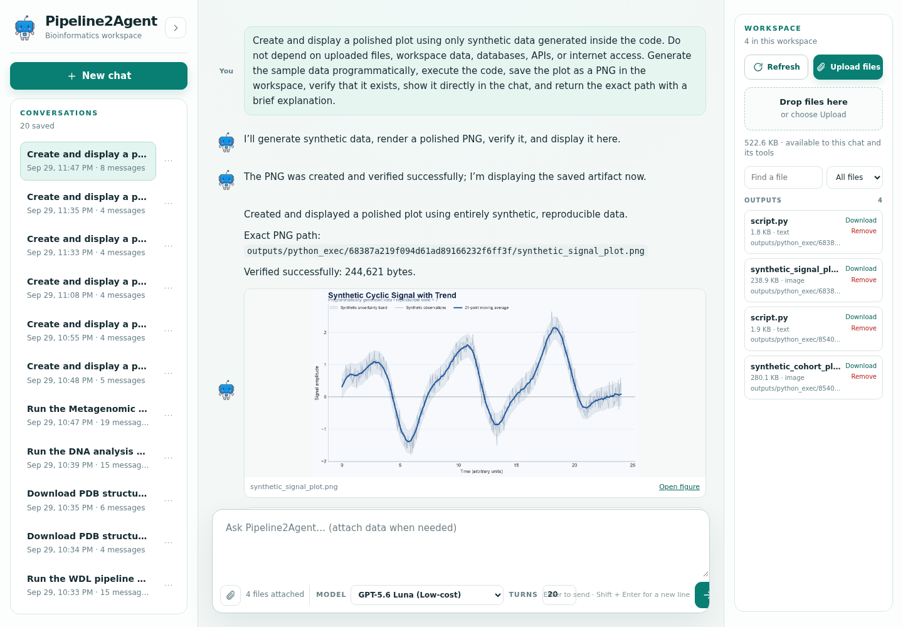

### Compact assistant

Open `/assistant`, verify the Ready state and composer, and use New chat to
reset the conversation. These control checks did not submit a new model prompt.

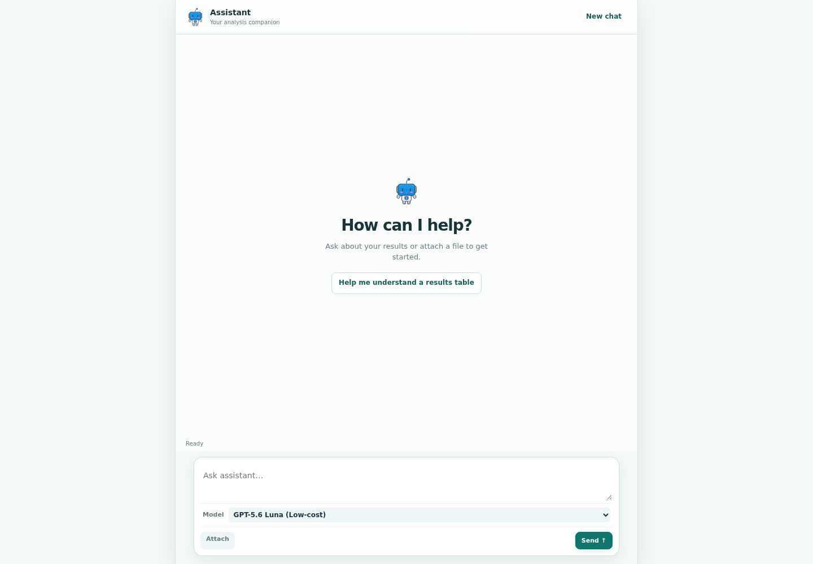

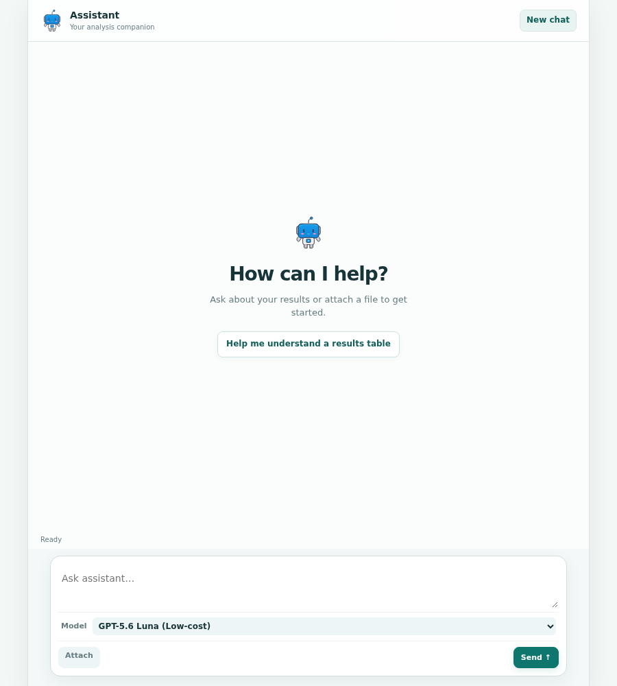

### Website demo controls

Open `/assistant-demo`, wait for the trusted connection, close the drawer,
select the treated cohort, open Methods, and reopen the drawer. The drawer
opens by default and overlays some host controls; closing it exposes them.

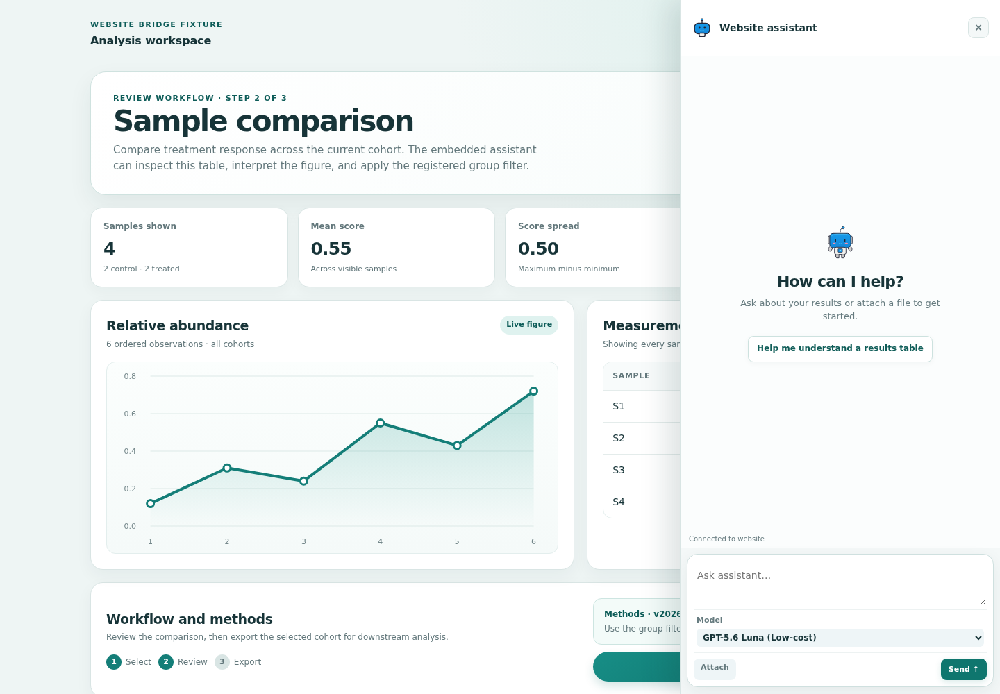

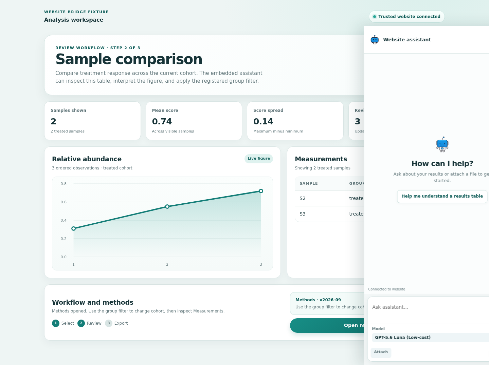

### Mobile workspace

At 390 × 844 px, open and close the navigation and workspace drawers. The saved
screenshot shows the final collapsed-drawer state and the NCBI retrieval prompt;
it does not show that request's completed result.

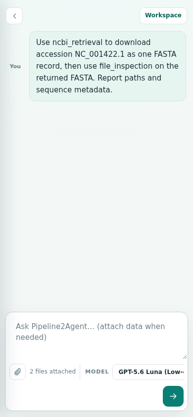

## Testing prompts and observed results

The following prompts were recovered from the saved session messages. Uploaded
paths are the exact paths used in those sessions; a new upload receives a new
path. The research follow-up depends on evidence created in the original
research session.

Each case links its retained result. The [prompt manifest](images/frontend_test_2026-09-30/test_prompts.json)
also records session IDs, tool names, and errors recovered from session
metadata. Only the website run retains a full structured trace in this asset
folder; most other JSON files are compact summaries.

### 1. Direct model and sequence-statistics probe

Session: `live-probe-20260930-direct`.

**Testing prompt**

```text
Analyze this DNA sequence and report its GC content: ACGTACGT.
```

**Observed result:** **Model connection verified; tool validation failed.** The direct-connection run returned an answer of **50% GC** (4 of 8 bases), but the only `sequence_stats` result was `Invalid JSON input for tool sequence_stats`. The final answer was not tool-verified. The earlier attempt failed before tool execution because the inherited proxy URL scheme was unsupported.

[Recovered prompt and result](images/frontend_test_2026-09-30/test_prompts.json)

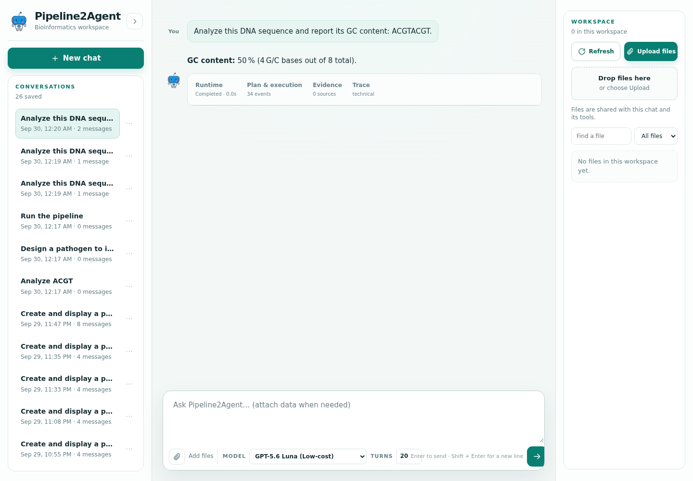

### 2. Sequence tool chain

Session: `live-seq-20260930`.

**Testing prompt**

```text
Use sequence_stats, sequence_reverse_complement, sequence_find_orfs, and sequence_translate on this DNA sequence (all four tools explicitly). Return verified length, GC%, reverse complement, ORFs, and translation: ATGAAATAGCCCGGGTTT.
```

**Observed result:** **Partial / turn limit.** The run invoked `sequence_stats`, `sequence_reverse_complement`, and `sequence_find_orfs`, then ended with `Max turns (10) exceeded`. Invalid tool-input attempts also occurred. Translation was not completed in this chain.

**Recorded tools:** `sequence_stats`, `sequence_reverse_complement`, `sequence_find_orfs`.

[Saved result JSON](images/frontend_test_2026-09-30/live/sequence_tools.json)

### 3. Separate translation request

Session: `live-translate-20260930`.

**Testing prompt**

```text
Call sequence_translate on this DNA sequence with frame 0 and report the returned amino-acid sequence: ATGAAATAG.
```

**Observed result:** **Tool validation failure despite a final answer.** The saved answer says `MK*` and the response status is `ok`, but the underlying session evidence records three `Invalid JSON input for tool sequence_translate` failures. No successful translation tool output was recorded, so this case is not a verified translation pass.

**Recorded tools:** `sequence_translate`.

[Saved result JSON](images/frontend_test_2026-09-30/live/sequence_translate.json)

### 4. PDB download and structure inspection

Session: `live-structure-20260930`.

**Testing prompt**

```text
Use pdb_download to download PDB 1A3N as mmCIF, then use structure_inspect on the returned workspace path. Report the file path and verified chains, residues, atoms, method, and resolution.
```

**Observed result:** **Passed for artifact generation and inspection.** `pdb_download` saved `outputs/pdb_downloads/1A3N.cif`; `structure_inspect` returned structure measurements. The retained JSON contains the answer and artifact metadata. No dedicated interactive 3D viewer screenshot was retained for this case.

**Recorded tools:** `pdb_download`, `structure_inspect`.

[Saved result JSON](images/frontend_test_2026-09-30/live/structure_tools.json)

### 5. NCBI retrieval and file inspection

Session: `live-retrieval-20260930`.

**Testing prompt**

```text
Use ncbi_retrieval to download accession NC_001422.1 as one FASTA record, then use file_inspection on the returned FASTA. Report paths and sequence metadata.
```

**Observed result:** **Passed.** The tools downloaded one FASTA record to `outputs/ncbi_output/NC_001422.1.fasta` and inspected it. The mobile screenshot above shows this prompt during the frontend review, rather than its completed response.

**Recorded tools:** `ncbi_retrieval`, `file_inspection`.

[Saved result JSON](images/frontend_test_2026-09-30/live/retrieval_tools.json)

### 6. AlphaFold, database lookup, and BLAST submission

Session: `live-db-blast-20260930`.

**Testing prompt**

```text
Use alphafold_download for UniProt accession P0A7V8 in CIF format, use database_lookup for P0A7V8 in UniProt, and use blast_search with query sequence ATGCGTAAACCCGGGTTT (report whether it is submitted or completed). Execute all three tools and summarize only observed results.
```

**Observed result:** **Passed for download, lookup, and submission; BLAST results remain pending.** The AlphaFold CIF and UniProt record were retrieved. BLAST returned RID `BRTT3DXS016` with state `SUBMITTED`; completed search hits were not verified.

**Recorded tools:** `alphafold_download`, `database_lookup`, `blast_search`.

[Saved result JSON](images/frontend_test_2026-09-30/live/database_blast_alphafold.json)

### 7. Table analysis, workspace search, and code inspection

Session: `live-data-code-20260930`.

**Testing prompt**

```text
Use file_inspection on uploads/ffb46617f019_measurements.csv, workspace_search to find the phrase "treated cohort" in uploads/28ab57bb04b6_notes.txt, table_profile on uploads/ffb46617f019_measurements.csv, table_group grouped by group with score, table_plot for score, code_inspection on uploads/f9bf3c5bc00b_analysis.py, and code_test on uploads/f9bf3c5bc00b_analysis.py. Then use report_write to save a short Markdown report of the observed results. Execute the requested tools and return every artifact path.
```

**Observed result:** **Passed for the recorded workflow.** The run inspected the four-row CSV, found the requested text, profiled/grouped/plotted scores, inspected code, completed a code check, and wrote a Markdown report. Recorded artifacts include `groups.csv`, `distribution.png`, and `Data_Inspection_Report.md`.

**Recorded tools:** `file_inspection`, `workspace_search`, `table_profile`, `table_group`, `table_plot`, `code_inspection`, `code_test`, `report_write`.

[Saved result JSON](images/frontend_test_2026-09-30/live/data_workspace_coding.json)

### 8. Uploaded PDF reading

Session: `live-document-20260930`.

**Testing prompt**

```text
Use document_read on the uploaded PDF at uploads/c8b3c6564813_pipeline_agent_introduction.pdf, read the first page, and summarize only what is returned with page markers.
```

**Observed result:** **Passed for a bounded first-page read.** `document_read` returned a page-marked result for the uploaded project introduction PDF. The answer identified the first-page heading, “PIPELINE2AGENT · SYSTEM ARCHITECTURE.” This case did not request a full-document summary.

**Recorded tools:** `document_read`.

[Saved result JSON](images/frontend_test_2026-09-30/live/document_read.json)

### 9. Genome features and map artifacts

Session: `live-genome-20260930`.

**Testing prompt**

```text
Use genome_read_features on uploads/3d712971b4c3_test.gb, then genome_render_map using its returned feature artifact. Return the generated map and reference paths and explain whether features are annotated.
```

**Observed result:** **Artifacts generated with a fixture warning.** The tools extracted the annotated gene/CDS features and wrote `genome_map.json` and `reference.fasta`. The fixture declared 30 bp but contained 31 bases, generating Biopython warnings. No dedicated genome-viewer interaction screenshot was retained.

**Recorded tools:** `code_inspection`, `genome_read_features`, `genome_render_map`.

[Saved result JSON](images/frontend_test_2026-09-30/live/genome_map_tools.json)

### 10. Initial research and reporting request

Session: `live-research-20260930`.

**Testing prompt**

```text
Use pubmed_search and web_search to collect bounded evidence about PhiX174 genome organization. Use web_fetch on one returned HTTPS source if possible. Then use evidence_index and evidence_retrieve on the returned evidence paths, use the research specialist (including report_review and report_synthesize), and use report_write to save a cited Markdown report. Return tool names, source IDs, and the report path. Stop and report exact errors if a network source is unavailable.
```

**Observed result:** **Partial / external timeout.** `pubmed_search` saved evidence, but `web_search` returned `ConnectTimeout`. The agent stopped the remaining requested steps. The research specialist was requested in the prompt, but its invocation is not established by this record.

**Recorded tools:** `pubmed_search`, `web_search`.

[Saved result JSON](images/frontend_test_2026-09-30/live/research_reporting.json)

### 11. Evidence indexing and reporting follow-up

Session: `live-research-20260930`.

**Testing prompt**

```text
Continue from the PubMed evidence already saved in this session. Call evidence_index on outputs/pubmed_search/8210655c6d6f47ef832ea5fb44666816/evidence.json, then evidence_retrieve for the question "What is PhiX174 genome organization?", then use report_review and report_synthesize on the retrieved evidence, and finally call report_write to save the cited Markdown report. If any call fails, continue with the remaining calls and report exact errors.
```

**Observed result:** **Passed using existing PubMed evidence.** In the same research session, `evidence_index`, `evidence_retrieve`, `report_review`, `report_synthesize`, and `report_write` completed. The saved report is `outputs/report_write/1eb275cb090c47bc9352cda9dfeb33d0/PhiX174_Genome_Organization.md`.

**Recorded tools:** `evidence_index`, `evidence_retrieve`, `report_review`, `report_synthesize`, `report_write`.

[Saved result JSON](images/frontend_test_2026-09-30/live/research_followup.json)

### 12. Knowledge ingestion, status, and retrieval

Session: `live-knowledge-20260930`.

**Testing prompt**

```text
Start a bounded knowledge collection using knowledge_ingest for https://example.org with allowed domain example.org, max_pages 1 and max_depth 0. Then call knowledge_status on the returned job ID and knowledge_retrieve for the question "What is the Example Domain page?". Return exact collection/job IDs and errors; do not invent content.
```

**Observed result:** **Invocation and retrieval verified; terminal ingestion state not captured.** The run returned collection `kb_e85e119295064f8e961ec7ae4d899b9b` and job `kj_1a968e978c32451d87e1c63e41180358`. The status snapshot showed indexing, and the subsequent retrieval returned an Example Domain source.

**Recorded tools:** `knowledge_ingest`, `knowledge_status`, `knowledge_retrieve`.

[Saved result JSON](images/frontend_test_2026-09-30/live/knowledge_tools.json)

### 13. Bounded web-page fetch

Session: `live-webfetch-20260930`.

**Testing prompt**

```text
Call web_fetch on https://example.org with a bounded character limit and report the returned title, URL, and excerpt. Do not use other tools.
```

**Observed result:** **Passed.** `web_fetch` returned the Example Domain title, URL, and a bounded excerpt. This was a separate request from the failed search workflow.

**Recorded tools:** `web_fetch`.

[Saved result JSON](images/frontend_test_2026-09-30/live/web_fetch.json)

### 14. Code editing, testing, and Python execution

Session: `live-coding-edit-python-20260930`.

**Testing prompt**

```text
Use code_edit on uploads/db2444b9d32d_calc.py to change the function to return 2 + 3, then use code_test on that path. Finally use python_execute with bounded code that writes the exact text 5 to outputs/result.txt; pass output_paths explicitly as ["outputs/result.txt"]. Report all observed statuses and paths.
```

**Observed result:** **Partial, with execution recovery.** The code edit succeeded. `code_test` returned `python -m pytest failed with exit code 1`; this is a failed test command, regardless of the top-level `ok` status. `python_execute` initially failed to create its expected output, then succeeded on retry and saved `outputs/python_exec/b88c32c862f24c769ff55b4252504ca4/outputs/result.txt` containing `5`.

**Recorded tools:** `code_inspection`, `code_edit`, `code_test`, `python_execute`.

[Saved result JSON](images/frontend_test_2026-09-30/live/coding_edit_python.json)

### 15. Live website bridge across all nine callbacks

Session: `assistant_c84cab9a374f468593cb861e5a9293a2`.

**Testing prompt**

```text
Use website_context, website_read_table, website_read_figure, website_search_manual, website_read_manual, website_import_data, website_highlight, website_navigate, and website_action. First read current context, read the Measurements table and Relative abundance figure, search and read the Methods manual, import the measurements resource, highlight the measurements element, navigate to Methods, and invoke the set_group_filter action with group treated. Report every observed result, including revisions, and do not invent values.
```

**Observed result:** **Browser action verified after a retry.** The SDK trace records all nine website tools, with two `website_action` attempts. An initial call failed because `arguments_json` was not a JSON object. The final screenshot shows two treated samples, mean score **0.74**, and Methods opened. The saved answer reports the imported table at `inputs/measurements.csv` and revision `comparison-2`. The compact evidence list retains the first error; it does not list all successful callback tools.

**Recorded tools:** `website_context`, `website_read_table`, `website_read_figure`, `website_search_manual`, `website_read_manual`, `website_import_data`, `website_highlight`, `website_navigate`, `website_action`.

[Saved result JSON](images/frontend_test_2026-09-30/live/website_run.json)

[Compact run summary](images/frontend_test_2026-09-30/live/website_run_summary.json) · [Browser text](images/frontend_test_2026-09-30/website-live-dom.txt) · [Browser capture summary](images/frontend_test_2026-09-30/website-live-summary.json)

The browser capture script waited for a second assistant-message element and timed out after the backend had completed. This was a capture-selector problem; the completed run and its rendered response were retained.

The three retained screenshots show the live demo connected, the composer before submission, and the host page after the action.

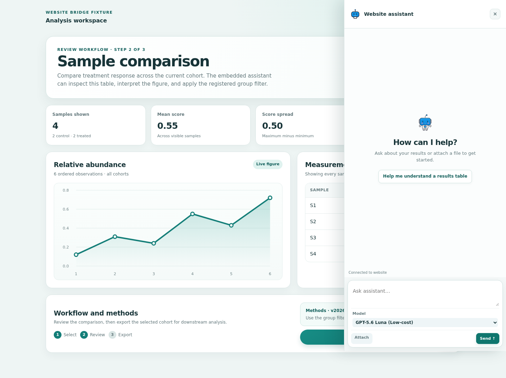

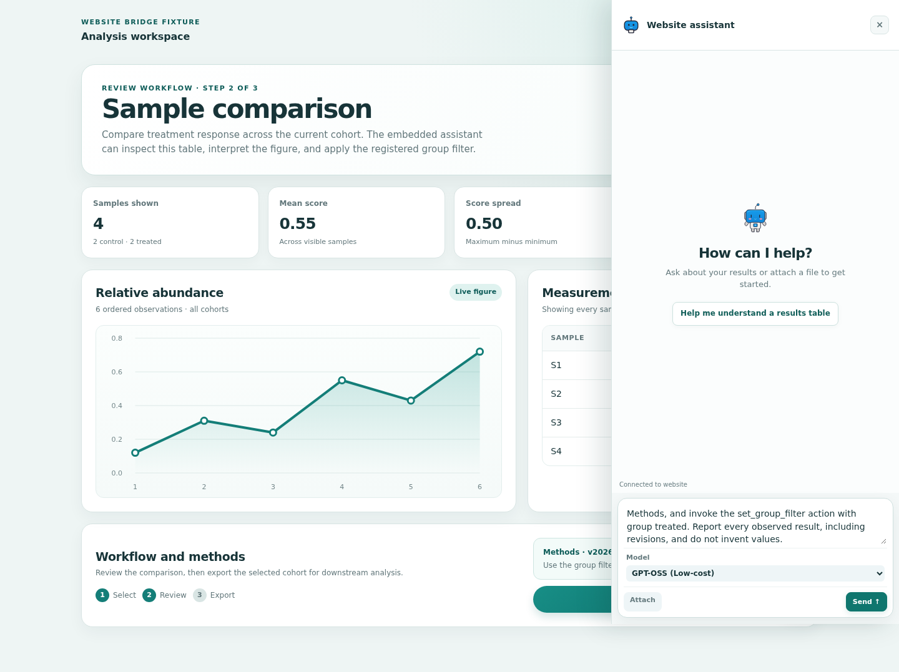

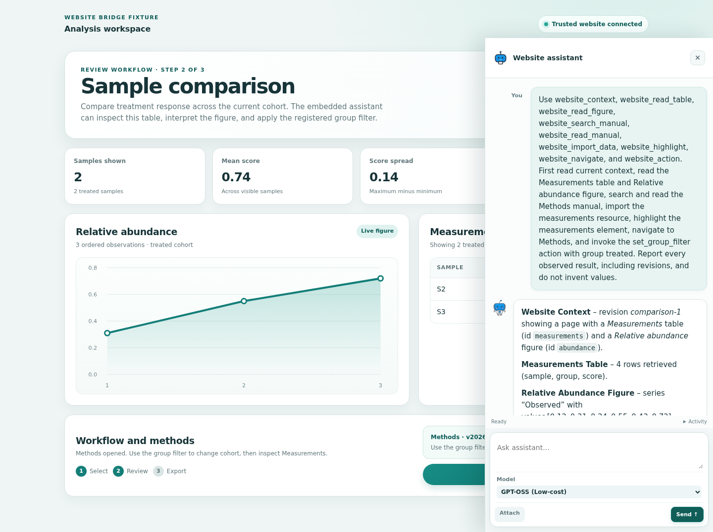

## User message formatting follow-up

Sent user messages now render paragraphs, line breaks, headings, lists, links and
code blocks. The knowledge quick start is organized into ingestion, retrieval and
evidence sections. User bubbles have more spacing, top-aligned avatars and bounded
code blocks; underscores inside tool names and scientific identifiers stay literal.

The frontend build and the nine existing browser checks passed again. Browser
checks with mocked API responses exercised sending on both the full workspace and
compact assistant at desktop and mobile widths, plus reloading the workspace.
They verified that the submitted text was unchanged, formatting persisted, long
code stayed inside its bubble and HTML remained escaped. These were rendering
checks, without another live model call. [Check results](images/frontend_test_2026-09-30/user-bubble-checks.json).

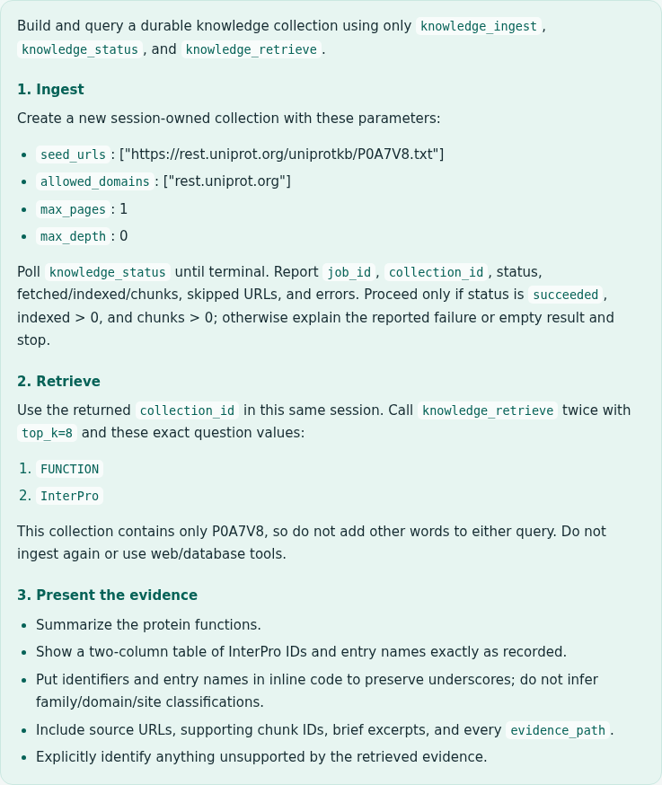

[Mobile screenshot](images/frontend_test_2026-09-30/user-bubble-mobile.png).

## Findings and follow-up

- **Direct probe:** the model connection worked after correcting the proxy
  setting, but `sequence_stats` failed input validation. The displayed 50% GC
  answer does not establish successful tool execution.
- **Sequence chain:** the combined request exceeded 10 turns. Its separate
  translation request returned a final answer, but session evidence records
  three invalid-JSON tool failures and no successful translation tool result.
- **Search:** `web_search` timed out. PubMed retrieval and a separate `web_fetch`
  request succeeded; reporting resumed using saved PubMed evidence.
- **Coding:** the edit/execution case had a failing `code_test` command and an
  initial Python execution failure. Python execution later succeeded. The
  earlier table/workspace case separately recorded a successful code check.
- **Asynchronous work:** BLAST was submitted rather than completed. The
  knowledge status snapshot still showed indexing; subsequent retrieval
  returned a source, but no terminal ingestion-status check was retained.
- **Fixture quality:** the hand-built GenBank fixture declared 30 bp but
  contained 31 bases. Biopython warned about the fixture while feature/map
  generation completed.
- **Website reporting:** the browser and SDK trace show the treated-cohort
  action completed after a retry. The compact evidence list retains the
  initial `website_action` JSON error and omits successful callback tools, so
  trace and screenshot evidence are needed to assess this case.
- **Evaluation maintenance:** update the OpenRouter assertion from
  `sequence_analyze` to `sequence_stats` and rerun it with a valid transport.
- **Remaining coverage:** a registry exclusion option would make runtime-tool
  exclusion explicit. Dedicated structure/genome viewer interaction tests and
  screenshots are still needed for a complete frontend interaction audit.
- **Build/deployment:** review the 3Dmol warnings as needed and rebuild/restart
  the older server before comparing its UI with these captures.

## Asset layout

The merged folder contains the original ten unique PNG screenshots, the two user
message formatting screenshots, retained result JSON files, the website DOM
snapshot, and the recovered prompt manifest:

```text
docs/
  frontend_test_report_2026-09-30.md
  images/
    frontend_test_2026-09-30/
      *.png
      test_prompts.json
      website-live-dom.txt
      website-live-summary.json
      live/
        *.json
```

The original screenshots and result files were preserved without changing their
contents. Duplicate image copies were removed only after byte-for-byte checks;
all report links point into this folder.

## Live progress presentation follow-up

Real-time public narration remains visible in a small muted area, with a current
operation label and a two-line preview. **Activity** expands the updates and tool
steps. On completion it collapses above the final Markdown answer. The same
presentation is used in the full chat and compact assistant. Stopping or losing
the stream preserves activity in the current view and unlocks the composer.

The stream now retains agent/call/item/output-kind metadata during worker
batching. Typed review and synthesis JSON is excluded from the activity view.
Response completion separates narration even if the provider omits
`response.output_text.done`, avoiding concatenated messages and duplicate final
reports. Private reasoning is not used in this UI.

Testing prompt:

```text
Search PubMed and trusted sources. Review evidence and write a cited report.
```

Validation used a **local SSE fixture**, with the final response held until the
browser verified live updates. It did not run a new paid model or research query.
The fixture includes nested review/draft JSON and intentionally omits
`response.output_text.done` to reproduce the observed provider behavior.

- Build: `npm --prefix frontend run build` passed (existing 3Dmol warnings remain).
- Backend and existing regression checks: 19 tests passed with
  `python -m unittest evals.test_live_progress evals.smoke_atomic_tools evals.smoke_web_contract evals.smoke_chat_rendering`.
- Browser: `python -m evals.check_live_progress_browser` checks desktop, mobile,
  and compact assistant; live preview before completion; hidden internal JSON;
  separated narration; keyboard expand/collapse; one formatted final report;
  retained activity; horizontal overflow; JavaScript errors; and stop/error
  recovery on both routes.
- [Browser results](images/frontend_test_2026-09-30/live-progress-checks.json).

Screenshots were visually inspected:

| View | Screenshot |
| --- | --- |
| Desktop, live | [Muted live progress](images/frontend_test_2026-09-30/live-progress-desktop.png) |
| Expanded activity | [Public narration and tool steps](images/frontend_test_2026-09-30/live-progress-expanded.png) |
| Mobile, live | [Mobile progress](images/frontend_test_2026-09-30/live-progress-mobile.png) |
| Compact assistant | [Compact progress](images/frontend_test_2026-09-30/live-progress-compact.png) |
| Completed | [Collapsed activity and final report](images/frontend_test_2026-09-30/live-progress-completed.png) |

These captures use fixture data and an isolated browser profile. Existing live
servers and research sessions were left running.

## Activity survives page refresh

The initial activity implementation kept its display state only in browser
memory. Reloading restored the SDK's intermediate assistant messages as normal
bubbles. Conversation loading now groups those messages into activity above the
final answer and restores tool steps/nested public narration from saved run
events using the same reducer as live streaming. Nothing is re-executed.

For older runs whose text deltas lost scope metadata, restoration uses saved
narration and tool events, excluding the unsafe mixed text stream. If event
history is unavailable, saved narration still stays in the compact activity
section. Final results, report formatting, artifacts, and approvals remain
associated with their messages.

Validation:

- Production frontend build passed.
- 16 existing session-history, web-contract, and chat-rendering tests passed.
- The browser regression now covers desktop/mobile reloads and an independent
  browser context, with activity collapsed initially, narration/tool steps
  restored, one final report, and no extra run submission.
- Repeated prompts with identical answers retain the correct activity per turn;
  legacy events and unavailable event logs have dedicated browser checks.
- Read-only verification of the existing research conversation on port 8123
  found **2 final assistant messages, 2 activity sections, 3 saved narration
  entries, and 27 tool steps** both before and after reload, with no JavaScript
  errors. The conversation was not rerun.

Evidence:

- [Reloaded desktop activity](images/frontend_test_2026-09-30/live-progress-reloaded-desktop.png)
- [Reloaded mobile activity](images/frontend_test_2026-09-30/live-progress-reloaded-mobile.png)
- [Existing research conversation after reload](images/frontend_test_2026-09-30/live-progress-existing-reloaded.png)
- [Existing conversation checks](images/frontend_test_2026-09-30/live-progress-existing-reload-checks.json)
- [Browser regression results](images/frontend_test_2026-09-30/live-progress-checks.json)
