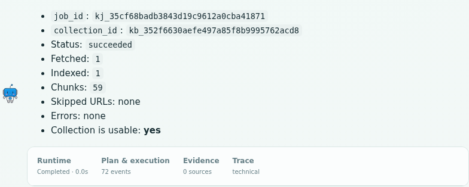
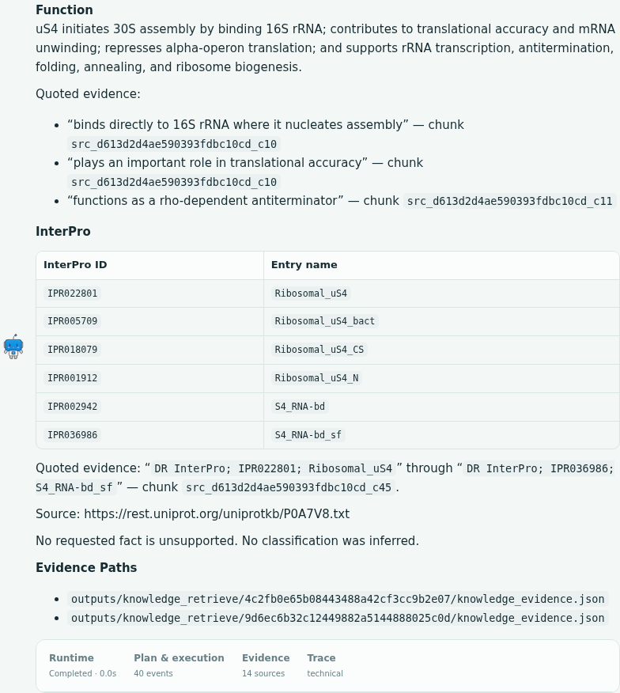
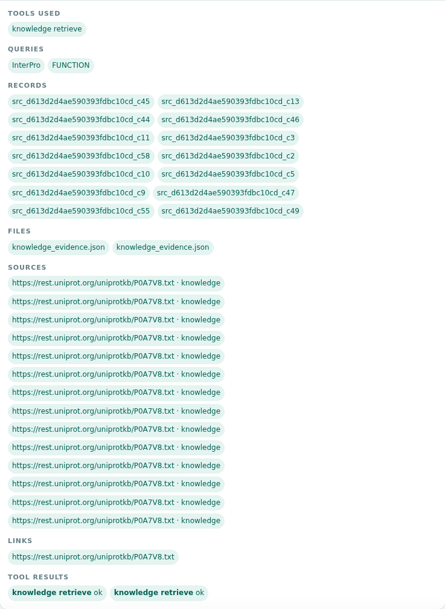

# Knowledge ingestion and retrieval test — 2026-09-30

The ingestion defect is fixed and the live demo now works. Using **GPT-5.6 Sol
through OpenRouter**, the browser ingested the requested UniProt record into a
durable collection with **1 fetched page, 1 indexed source and 59 chunks**.
Subsequent turns used only `knowledge_retrieve`. The final tested prompt returned
function evidence and all six InterPro IDs with their exact entry names.

The frontend still has display defects, and retrieval remains sensitive to query
wording. Those limitations are recorded below rather than counted as passes.
Screenshots and JSON evidence are in [the asset folder](images/knowledge_test_2026-09-30/).

## Why the original requests returned 0/0/0

The two original jobs were inspected directly in the existing SQLite database,
without modifying them:

- `kj_db8cb90e408146e6bc09c6d6d9cee3f8`
- `kj_e478de30804f4780afaeaaaee32e459f`

Both stored the correct seed URL, allowlist, `max_pages=1` and `max_depth=0`.
Both reported `succeeded` with zero fetched pages, indexed sources and chunks.
[Original job records](images/knowledge_test_2026-09-30/original_empty_jobs.json).

Running the original crawler in the documented `openaisdk` environment reproduced
an empty result and no progress events. Its stderr contained:

```text
NameError: Module '__main__' doesn't define any object named 'CollectPipeline'
```

Three implementation problems explained the failure:

1. The Scrapy pipeline class was defined inside `main()` but registered under a
   module-level import path. Scrapy failed during initialization.
2. The runner ignored the failed crawl Deferred, printed a completion message and
   exited successfully. The worker then unconditionally marked the empty index
   `succeeded`. Detached workers discarded stderr, hiding the cause from status.
3. The spider only defined `start_requests()`. Installed Scrapy **2.19.0** uses
   `async start()`; fixing the pipeline alone would still leave the seed unscheduled.
   See the [official Scrapy startup API](https://docs.scrapy.org/en/latest/topics/spiders.html#scrapy.Spider.start).

The URL itself returned HTTP 200 with readable UniProt text. Depth zero correctly
means fetch the seed without following its links. This was an implementation
failure, not a reason to increase crawl depth or rewrite the original ingest prompt.

## Changes

- [Scrapy runner](../tools/infrastructure/knowledge/crawlers/scrapy/runner.py):
  collect items through Scrapy signals, publish fetched progress, catch startup
  failures and exit unsuccessfully with a structured error.
- [Spider](../tools/infrastructure/knowledge/crawlers/scrapy/spider.py): implement
  `async start()` and report skipped URLs, download errors and HTTP status codes.
- [Subprocess adapter](../tools/infrastructure/knowledge/crawlers/scrapy/__init__.py):
  propagate runner errors to the knowledge worker.
- [Worker](../tools/infrastructure/knowledge/worker.py): fail empty crawls, preserve
  diagnostics, derive fetched counts from actual pages and require stored chunks
  before reporting success. An unchanged refresh of an existing populated
  collection can still succeed without creating duplicate chunks.

Existing empty collections were not automatically rebuilt. Start a new ingestion
after loading the updated code; retrieval alone cannot populate them.

## Live environment and results

| Item | Observed value |
|---|---|
| Python environment | `openaisdk`, Python 3.11, Scrapy 2.19.0 |
| Chat model | `gpt-5.6-sol` / `openai/gpt-5.6-sol` |
| Embedding model | `nvidia/llama-nemotron-embed-vl-1b-v2:free` |
| Model transport | Existing local proxy, `AGENT_PROXY=socks5h://127.0.0.1:10801` |
| Browser | Headless Google Chrome controlled with Playwright |
| Test server | `http://127.0.0.1:8143`, isolated from the existing user server |
| Persistence | `/tmp/bioagent-knowledge-test-20260930/` |
| Session | `web-1790736781331-3stf1t` |
| Job | `kj_35cf68badb3843d19c9612a0cba41871` |
| Collection | `kb_352f6630aefe497a85f8b9995762acd8` |
| Terminal result | `succeeded`; fetched/indexed/chunks = **1/1/59** |
| Collection state | `ready`, 1 stored source, 59 stored chunks, exactly 1 ingest job |

The initial direct OpenRouter connection failed with HTTP 403: the model was not
available in that region. Retrying through the already-configured local proxy
succeeded with GPT-5.6 Sol; no substitute model was used.
[Recorded provider failure](images/knowledge_test_2026-09-30/direct_connection_failure.json).
The supplied credential was entered into the test process through a hidden prompt
and was not written to the report or saved artifacts.

| Browser turn | Outcome | Runtime from trace timestamps |
|---|---|---|
| 1: ingest and status | One ingest call and three status calls; 1/1/59; no skipped URLs or errors | 28.37 s |
| 2: natural-language retrieval | Two retrieval calls, eight chunks each; function evidence and six InterPro IDs returned; tentative classifications were unnecessarily added | 16.12 s |
| 3: query refinement | Two retrieval calls, twelve chunks each; function evidence returned, but InterPro lines missed | 14.62 s |
| 4: final exact-term prompt | Two retrieval calls, eight chunks each; function evidence, six exact InterPro ID/name pairs and two evidence files returned | 14.49 s |

The final queries were exactly `FUNCTION` and `InterPro`. The successful function
evidence included chunks ending `_c10` and `_c11`; the InterPro list came from
`src_d613d2d4ae590393fdbc10cd_c45`. All records came from the
[requested UniProt source](https://rest.uniprot.org/uniprotkb/P0A7V8.txt).
The final response did not infer InterPro entry classifications.

The two final evidence artifacts were downloaded successfully through the workspace
HTTP endpoint and retained as [evidence 1](images/knowledge_test_2026-09-30/final_evidence_1.json)
and [evidence 2](images/knowledge_test_2026-09-30/final_evidence_2.json). Their original paths are:

```text
outputs/knowledge_retrieve/9d6ec6b32c12449882a5144888025c0d/knowledge_evidence.json
outputs/knowledge_retrieve/4c2fb0e65b08443488a42cf3cc9b2e07/knowledge_evidence.json
```

These IDs belong to the isolated test session. Use a newly created collection in
your own chat rather than copying this test collection ID into another session.

## Validation and frontend findings

**10 focused regression tests passed** in the environment with Scrapy installed.
The existing knowledge, architecture and session-artifact checks also passed.

```bash
conda activate openaisdk
python -m unittest evals.test_knowledge_ingestion
python -m evals.smoke_knowledge
python -m evals.smoke_architecture
python -m evals.smoke_session_artifacts
git diff --check
```

Tests cover empty-crawl failure, preserved skip diagnostics, startup-error
propagation, accurate counts, unchanged refreshes, async seed scheduling, depth
zero, request failures and HTTP status reporting. The base Python environment
does not have Scrapy and skips its optional tests; the full pass above used
`openaisdk`.

Additional live checks:

- An invalid UniProt accession produced `failed`, skipped=1, chunks=0 and
  `HTTP 400: Ignoring non-200 response`, with its URL preserved.
  [Negative test](images/knowledge_test_2026-09-30/negative_ingest_result.json).
- A separate SQLite reader verified the stored source/chunk counts and that all
  three retrieval turns reused the one ingestion job.
  [Persistence check](images/knowledge_test_2026-09-30/collection_verification.json).
- A request for the job from another session returned HTTP 404.
- Runtime, Plan & execution, Evidence and Trace tabs opened and closed; evidence
  downloads worked; all four final responses survived a browser reload unchanged.
  No browser JavaScript exceptions were recorded.
  [Browser checks](images/knowledge_test_2026-09-30/browser_checks.json).

Remaining limitations:

- Streamed commentary/final text is duplicated before reload. Saved final results
  are available, but the live display needs a separate rendering fix.
- Runtime displays `0.0s` because the backend supplies `runtime: "agents_sdk"`
  while the frontend expects a metrics object. The table above uses trace timestamps.
- Unquoted underscores in entry names can be treated as emphasis by the renderer.
  The final tested prompt requests inline code and preserves the exact names.
- The Evidence tab displays 14 sources for the final result: these are 14 distinct
  chunk citations from **one URL**, not 14 independently fetched documents.
- The hybrid retriever can rank unrelated reference-list chunks above the desired
  annotation. Increasing `top_k` alone did not solve the failed third turn. Exact
  section terms worked for this single-record demo; this does not establish general
  retrieval quality across larger collections.
- The existing extractor caps page text at 60,000 characters. The fetched record
  was 64,851 characters; the requested function and InterPro sections were retained,
  but this test does not establish full-record preservation.

## Inspected screenshots

The screenshots below were opened and visually inspected after capture.







The [initial retrieval](images/knowledge_test_2026-09-30/2_retrieve.png),
[unsuccessful query refinement](images/knowledge_test_2026-09-30/5_refined_retrieval.png),
[response after reload](images/knowledge_test_2026-09-30/4_retrieval_after_reload.png)
and [workspace view](images/knowledge_test_2026-09-30/9_workspace.png) are also retained.

## Recommended demo prompts

Load the updated backend and use a new chat. Send these as **two separate messages
in the same session**. The first was tested as turn 1; the second was tested as
turn 4 using the collection created by turn 1. The intermediate retrieval trials
are not required.

### Message 1 — Ingest

```text
Build a new session-owned durable knowledge collection from https://rest.uniprot.org/uniprotkb/P0A7V8.txt using knowledge_ingest. Set seed_urls=["https://rest.uniprot.org/uniprotkb/P0A7V8.txt"], allowed_domains=["rest.uniprot.org"], max_pages=1, max_depth=0. Use only knowledge_ingest and knowledge_status in this turn. Poll knowledge_status until the job reaches a terminal state. Report job_id, collection_id, status, fetched/indexed/chunks, skipped URLs and all errors. Treat this new collection as usable only if indexed > 0 and chunks > 0. If it is empty or failed, explain the reported error and stop. Do not retrieve or answer biological questions yet.
```

### Message 2 — Retrieve

```text
Use the collection_id from the successful ingestion in this same session. Use knowledge_retrieve only; do not ingest again or use web/database tools. Make two focused retrieval calls with top_k=8 and these exact question values: "FUNCTION" and "InterPro". This collection contains only the P0A7V8 record, so do not add the accession, other words, or classification terms to either question. From the returned excerpts, give a concise function summary and a two-column table of InterPro IDs and entry names exactly as recorded. Put identifiers and entry names in inline code so underscores are preserved. Do not infer family/domain/site classifications from names or abbreviations. Include source URLs, supporting chunk IDs, brief quoted evidence, and every evidence_path. Say explicitly when the retrieved evidence does not support a requested fact.
```
