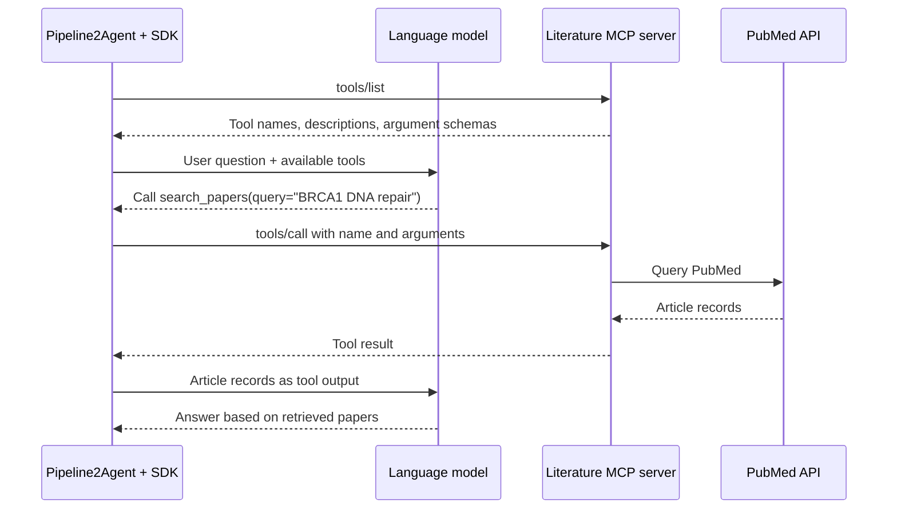

# Pipeline2Agent roadmap

1. **Phase 1 — Runnable foundation**
   - Provide the main functions.
   - Run the basic end-to-end workflow.

2. **Phase 2 — Intelligent planning**
   - Understand the user’s intent.
   - Plan the required tasks.

3. **Phase 3 — Autonomous analysis**
   - Accept a defined goal.
   - Analyze and work toward the goal autonomously.

4. **Phase 4 — MCP integration**
   - Add optional external MCP server connections alongside existing SDK function tools.
   - Evaluate biomedical servers such as [BioContextAI Knowledgebase](https://github.com/biocontext-ai/knowledgebase-mcp) and [community PubMed MCP](https://github.com/cyanheads/pubmed-mcp-server).
   - Evaluate [GitHub MCP](https://github.com/github/github-mcp-server) and [DeepWiki MCP](https://docs.devin.ai/work-with-devin/deepwiki-mcp) for repository and documentation access.
   - Support server configuration, connection lifecycle, authentication, and tool filtering.

## MCP integration notes

MCP (Model Context Protocol) standardizes how an AI application discovers and
calls capabilities provided by another program. Add MCP connections alongside
the existing function tools, specialists, and pipeline runtime; converting all
existing tools is not required.

For SDK-managed MCP connections, the roles are:

| Part | Role in Pipeline2Agent |
| --- | --- |
| Host | Pipeline2Agent manages the conversation, model, and available tools. |
| Client | The SDK's MCP client communicates with a configured server. |
| Server | A separate local or remote program exposes tools and executes their implementations. |

### Tool discovery and execution

1. Configure a server and connect through the SDK, discovering its supported protocol version and capabilities.
2. Discover available tools through `tools/list`. Each tool describes its name, purpose, and accepted arguments using a JSON schema.
3. Expose the selected tool definitions to the language model alongside existing SDK tools.
4. When the model selects an MCP tool, dispatch its name and arguments through `tools/call`.
5. Return the server's result to the model through the SDK tool loop. The model can continue calling tools or produce an answer.

For example, a future literature-search integration could work as follows. The
tool name below is illustrative.

The model selects the operation, the SDK dispatches it, and the MCP server
executes the underlying code or API request.

### Transport and additional capabilities

MCP uses JSON-RPC messages. Support these connection options as needed:

- **stdio:** Launch a local server process and communicate through its input/output streams.
- **Streamable HTTP:** Connect to a local or remote MCP endpoint over HTTP.

Servers can also expose **resources** (documents, records, or database schemas)
and **prompts** (reusable interaction templates). Their use depends on client
support; start with tool discovery and execution.

If other applications later need access to Pipeline2Agent's own capabilities,
expose selected operations through an MCP adapter over shared implementations.
The same server can then serve multiple compatible clients.

References: [MCP architecture](https://modelcontextprotocol.io/docs/learn/architecture),
[MCP tool specification](https://modelcontextprotocol.io/specification/2025-11-25/server/tools),
and [OpenAI Agents SDK MCP guide](https://openai.github.io/openai-agents-python/mcp/).
