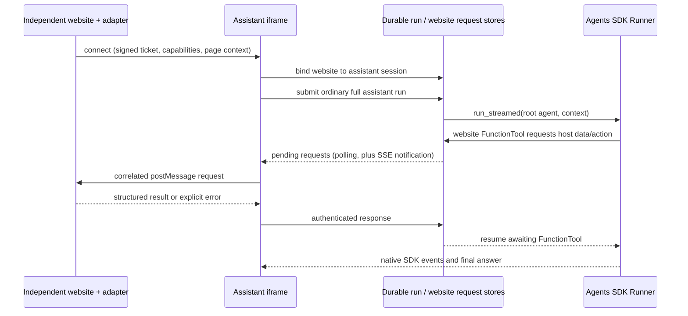

# Embed the full assistant in a trusted website

This contract describes protocol version **1**. The host website owns its pages,
tables, charts, workflow and login. BioAgent supplies an iframe drawer, the full
assistant, and an additional `website_guide` specialist. The host does not import
BioAgent workspace components. Its data does not become an assistant workspace
file until an explicit `website_import_data` call exports it.

## Architecture and SDK requirements



* The root keeps **all** existing biology, data analysis, search, knowledge,
  coding, files, reports, pipelines and specialist capabilities. Website mode
  adds capabilities; it does not replace the root with a restricted chatbot.
* `website_guide` is an SDK **Agent.as_tool()**, with the same shared run context
  as the root. Its job is explanation and guidance grounded in the current page,
  measured data and manual. It delegates computational work back to the root.
* Website reads/actions are small SDK FunctionTools. The bridge is application
  infrastructure, not a new tool type or another agent execution loop.
* Queued jobs retain the website binding. SQLite request/response records work
  across detached workers and HTTP server restarts. A live browser is needed for
  new page requests. A dead worker is marked interrupted by the existing queue;
  its side effects are not automatically replayed.
* DOM text, manuals and data are source material, not instructions that override
  the user or tool policy. Credentials and connection tokens never enter prompts.

The implementation uses native `function_tool`, `Agent.as_tool`, run context and
`Runner.run_streamed`; see the [OpenAI tools guide](https://developers.openai.com/api/docs/guides/tools).

## Quick start: the embedded host-page demo

`/assistant-demo` is the canonical local host page. It owns its table, figure,
filters, workflow, manual, and adapter callbacks; the assistant remains the
embedded `/assistant` iframe. Run this from the repository root:

```bash
export AGENT_WEBSITE_SECRET="$(python -c 'import secrets; print(secrets.token_hex(32))')"
export AGENT_WEBSITE_SITES='{"assistant-demo":["http://localhost:8000"]}'
python -m interfaces.web --host 127.0.0.1 --port 8000
```

Open `http://localhost:8000/assistant-demo`. Click the assistant launcher and
ask it to explain the visible table or figure. The page requests a short-lived
demo ticket from `/website/demo-token`; the signing secret stays on the server.
For a real external site, keep the same adapter and ticket contract but issue
tickets from that site's authenticated backend.

## Host integration API

Load `https://agent.example.com/static/assistant-embed.js`, create an empty mount
element, and provide a website adapter:

```javascript
const assistant = AssistantDrawer.mount({
  target: document.getElementById("assistant-root"),
  src: "https://agent.example.com/assistant",
  siteId: "lab-portal",
  getToken: async () => {
    const response = await fetch("/assistant-token", {method: "POST"});
    if (!response.ok) throw new Error("Assistant sign-in failed");
    return (await response.json()).token;
  },
  adapter: {
    getPageContext: async () => pageSnapshot(),
    readTable: async ({resource_id, offset, limit}) => tablePage(resource_id, offset, limit),
    readFigure: async ({resource_id}) => chartDescription(resource_id),
    searchManual: async ({query, limit}) => manualSearch(query, limit),
    readManual: async ({section_id}) => manualSection(section_id),
    exportData: async ({resource_id}) => exportResource(resource_id),
    highlight: async ({element_id}) => highlightRegisteredElement(element_id),
    navigate: async ({route_id}) => openRegisteredRoute(route_id),
    invokeAction: async ({action_id, arguments: args}, call) =>
      runRegisteredAction(action_id, args, call.call_id),
  },
  onEvent: (event) => console.log(event.type),
});

// Await after route, selection, filter, chart or workflow changes.
await assistant.updateContext();
assistant.open();
// On SPA unmount / logout:
assistant.destroy();
```

Only implement callbacks your website supports. `getPageContext` is required
when using the bridge. All callbacks may return promises. Their second argument
contains `call_id`, `run_id`, `revision` and `deadline` for correlation and
idempotency. `updateContext(snapshot)` accepts an already built snapshot;
`updateContext()` calls `getPageContext`. Existing context-only mounts still work.
`onEvent` receives connection, run, error and result notifications; it is not a
replacement for callback results. `open()`/`close()` control the drawer.

## Page and resource contracts

Use JSON-safe values, stable resource IDs, and a **new revision string whenever
the relevant page data changes**. Snapshots replace previous snapshots entirely.
Use registered IDs for elements and routes, not executable code or CSS selectors.
Website URLs are public HTTP(S) URLs, never server filesystem paths.

```json
{
  "revision": "analysis-17",
  "title": "Sample comparison",
  "url": "https://lab.example.com/results",
  "selection": {"sample_id": "S2"},
  "filters": {"cohort": "treated"},
  "workflow": {"step": "review", "steps": ["select", "review", "export"]},
  "resources": [
    {"id": "measurements", "kind": "table", "title": "Measurements", "exportable": true},
    {"id": "abundance", "kind": "figure", "title": "Relative abundance"}
  ],
  "elements": [{"id": "cohort-filter", "label": "Cohort filter"}],
  "routes": [{"id": "methods", "label": "Methods"}],
  "actions": [{"id": "set_cohort", "description": "Filter samples", "parameters": {"cohort": ["all", "treated", "control"]}}],
  "manual": {"version": "2026-09", "title": "Lab portal user guide"}
}
```

| Callback / SDK tool | Required result |
| --- | --- |
| `getPageContext` / `website_context` | Snapshot above. Only `revision` and `title` are mandatory; other fields depend on the website. |
| `readTable` / `website_read_table` | `{resource_id, title, columns:[{name,type,unit?}], rows:[{column:value}], offset, total_rows, filters?}`. Return at most the requested limit (1–200); do not imply a page is the whole dataset. |
| `readFigure` / `website_read_figure` | `{resource_id,title,description,x_axis?,y_axis?,series?,filters?,source_table?}`. Axes include units; series include actual values. Report missing values explicitly. This version reads structured chart data; it does **not** claim visual inspection of screenshots or pixels. |
| `searchManual` / `website_search_manual` | `{version, sections:[{id,title,excerpt,url?}]}`; at most the requested limit (1–20). |
| `readManual` / `website_read_manual` | `{section_id,title,version,text,url?}`. Return the selected versioned section. |
| `exportData` / `website_import_data` | `{filename,content,content_type}`; UTF-8 text such as CSV/TSV/FASTA/JSON. It becomes a unique session artifact with a relative workspace path, usable by existing tools. Binary files use the assistant's normal attachment upload UI. |
| `highlight` / `website_highlight` | `{element_id,message}` after highlighting/scrolling to the registered element. |
| `navigate` / `website_navigate` | `{route_id,message}` after SPA navigation. Publish a new snapshot. A full page reload disconnects the old bridge. |
| `invokeAction` / `website_action` | `{action_id,message,...}` after the host validates parameters and performs a registered action. Publish changed context. |

The agent cannot inspect arbitrary cross-origin DOM. The adapter runs in the
host window, where it can use the website's own authenticated API and UI state.
Never expose passwords, cookies, access tokens or unrelated DOM via context.
Do not send the whole database or manual on every question. Keep page context
under 64 KiB, each callback result under 512 KiB, and fetch larger tables in
pages. `website_import_data` uses the same 512 KiB response limit in this version.

The guide cites resource IDs, revision and manual section/version in its answers,
and distinguishes calculated values from explanations. It must report when data
is stale or unavailable. Screenshots/vision and automated manual crawling are
future optional adapters; existing Scrapy/RAG tools remain fully available.
Manual lookup here is live and host-owned; it does not silently ingest the manual.

## Trust and authentication

Configure `AGENT_WEBSITE_SITES` as `{site_id: [exact_origin, ...]}`. Wildcards and
opaque origins are not accepted. Set a secret of at least 32 characters using
`AGENT_WEBSITE_SECRET`. An embedding website backend authenticates its user and
returns a short-lived ticket. The browser never receives the signing secret.

Ticket format: `base64url(payload_json).base64url(HMAC_SHA256(secret, encoded_payload))`,
without base64 padding. Payload contains `{site_id, origin, sub, exp, jti}`;
`exp` is a Unix timestamp no more than five minutes ahead, `jti` is a fresh random
nonce, and `sub` is the host's authenticated user ID. Each ticket is used once.
The example server demonstrates this using only Python's standard library. Its
token endpoint is for local demonstration; replace its fixed subject with your
login identity and normal CSRF protection in a real host application.

Both windows check exact `event.origin` and `event.source`. Tickets travel through
`postMessage` to the named iframe origin, never URL parameters. The iframe trades
the ticket for a random binding token scoped to its session, site and browser
instance. Bridge requests require that token. Expired tickets cannot create new
bindings; established bindings expire after eight hours. Destroy/logout revokes
the binding. Every host callback still enforces the website user's permissions.

Trusted websites can use the full deployed assistant, including code and
pipeline operations under their existing policy. Trust does not bypass workspace
boundaries or automatically grant a different user's data. This bridge is **not
a replacement for deployment authentication**: the existing assistant API needs
your authenticated gateway in a multi-user deployment. The reference server has
no complete tenant/account authorization layer. Keep it local or behind that
gateway; do not treat the bridge ticket as protection for unrelated API routes.

## Transport contract (implemented by the embed library)

Messages use `protocol: 1`. The host supplies `agent-connect` with `site_id`,
`instance_id`, `ticket`, `capabilities` (callback names) and `context`.
`agent-context` replaces the snapshot. The iframe sends `agent-website-request`
with `{call_id,run_id,method,arguments,revision,deadline}`. The host replies with
`agent-website-response` and either `result` or `error:{code,message}`, echoing
`call_id`, `run_id`, `revision`. `agent-disconnect` revokes the binding.

| Assistant endpoint | Purpose |
| --- | --- |
| `POST /website/connect` | Ticket + session + instance + capabilities + snapshot → `{binding_id,token}`. |
| `POST /website/context` | Binding credentials + replacement `context`. |
| `POST /website/poll` | Binding credentials → `{requests:[...]}`. Poll while mounted; this also works during approval resume and SSE reconnect. |
| `POST /website/respond` | Binding credentials + correlated response; duplicates with identical content are accepted, conflicting/stale responses rejected. |
| `POST /website/disconnect` | Binding credentials → revocation. |
| `POST /run` or `/run_stream` | Normal payload plus `website:{binding_id,token}`. Returns the ordinary durable job/stream. All root tools remain available. |
| `GET /runs/{id}` and `/runs/{id}/events?after={sequence}` | Existing durable status/event polling. The drawer uses these to recover a dropped run stream. |

Run events include `website_tool_request` as a notification, without credentials.
The poll endpoint is authoritative for still-pending requests. A callback has a
45-second deadline. Unsupported callbacks, missing resources, stale revisions,
revoked bindings and timeouts return explicit errors to the model. Read results
are rejected if the page revision changed in flight. Actions may change revision;
their response still echoes the revision under which they were requested.

The host caches in-flight/completed callbacks by `call_id` for its mounted
instance, so polling/network retries do not repeat actions. For actions with
external side effects, the host backend **must** also use `call_id` as an
idempotency key. Exactly-once execution across a browser crash cannot be promised.
A new page load has a new instance and binding; it cannot execute old requests.
Closing the drawer keeps the adapter alive; destroying it disconnects. A browser
disconnect does not cancel computation already running on the agent server.

## Acceptance requirements

1. The standalone page works without the assistant; loading the embed adds no
   dependencies on BioAgent workspace components or data storage.
2. Cross-origin origin/source validation, ticket replay rejection, session and
   call correlation, stale revision handling, timeouts and duplicate responses
   are covered by tests.
3. The assistant can explain a visible chart from its data, read a table page,
   find a manual section, guide a workflow and import a dataset for existing
   analysis tools. Ordinary full-assistant questions and file uploads still work.
4. Requests persist across store instances/processes; streaming loss does not
   submit a second run or replay a host action. SDK tests use scripted models,
   so verification does not require a paid model request.
