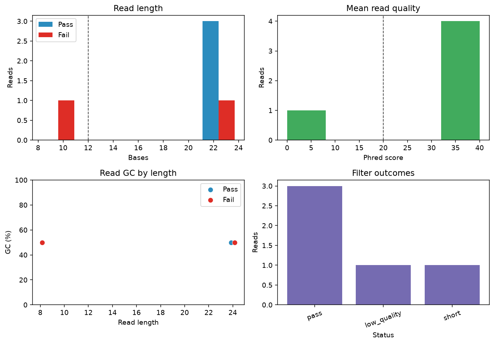
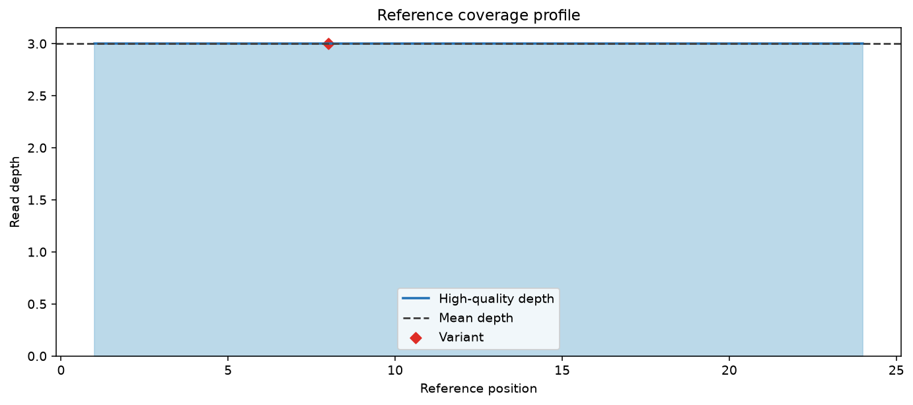
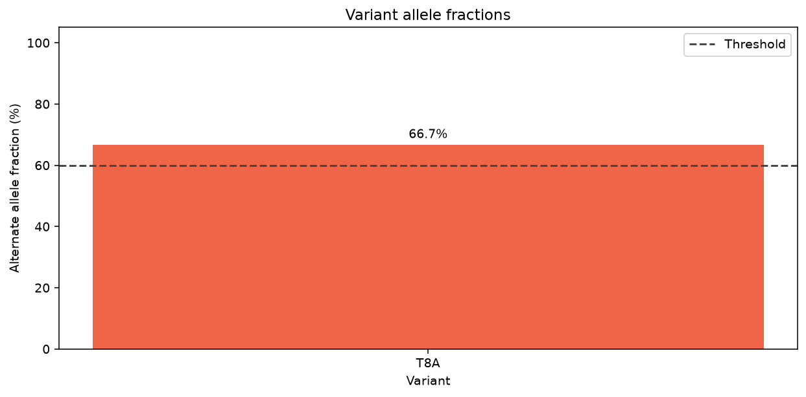
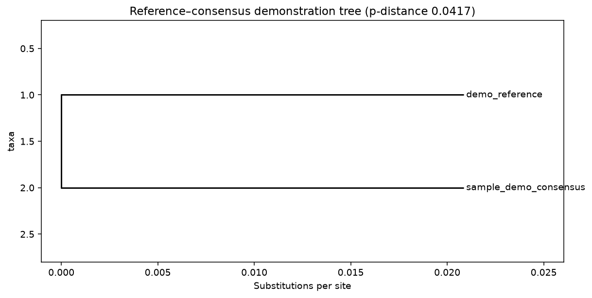

# Generic Bioinformatics Pipeline Report

- Run label: generic_bio_demo
- Sample: sample_demo
- Reference: demo_reference (24 bp)
- Reads: 3 / 5 passed filters
- Q30 bases: 76.92%
- Reference coverage: 100.0%
- Mean retained depth: 3.0×
- Passing variants: 1

## Workflow

```text
FASTQ + reference FASTA + metadata
  -> validation and read QC
  -> read filtering and demonstration alignment
  -> coverage, consensus, and variant calling
  -> tables, figures, metrics, and reports
```

## Inputs

- FASTQ reads: `data/input/example_reads.fastq`
- Reference FASTA: `data/input/example_reference.fasta`
- Metadata table: `data/input/example_samples.tsv`

## Sample metadata

| Field | Value |
| --- | --- |
| sample_id | sample_demo |
| organism | synthetic construct |
| condition | demo |
| replicate | 1 |
| library_layout | single-end |
| platform | Illumina |
| collection_date | 2026-01-15 |

## QC and results









## Passing variants

| Position | REF | ALT | Depth | ALT fraction | Type |
| ---: | --- | --- | ---: | ---: | --- |
| 8 | T | A | 3 | 0.6667 | transversion |

## Output manifest

| Artifact | Path |
| --- | --- |
| Metrics JSON | `metrics.json` |
| Filtered FASTQ | `filtered_reads.fastq` |
| Read QC table | `read_qc.tsv` |
| Sample summary table | `sample_summary.tsv` |
| Coverage table | `coverage.tsv` |
| Demonstration SAM | `alignments.sam` |
| Consensus FASTA | `consensus.fasta` |
| Variant VCF | `variants.vcf` |
| Variant summary table | `variant_summary.tsv` |
| QC overview figure | `qc_overview.png` |
| Coverage figure | `coverage.png` |
| Variant figure | `variant_allele_fraction.png` |
| HTML report | `report.html` |
| Phylogenetic tree | `phylogenetic_tree.nwk` |
| Phylogenetic tree figure | `phylogenetic_tree.png` |

## Important limitation

This educational demo places every retained read at reference position 1.
Its SAM and variant calls illustrate common formats but are not results from
a real aligner or validated variant caller. They must not be used for biological
or clinical interpretation.
